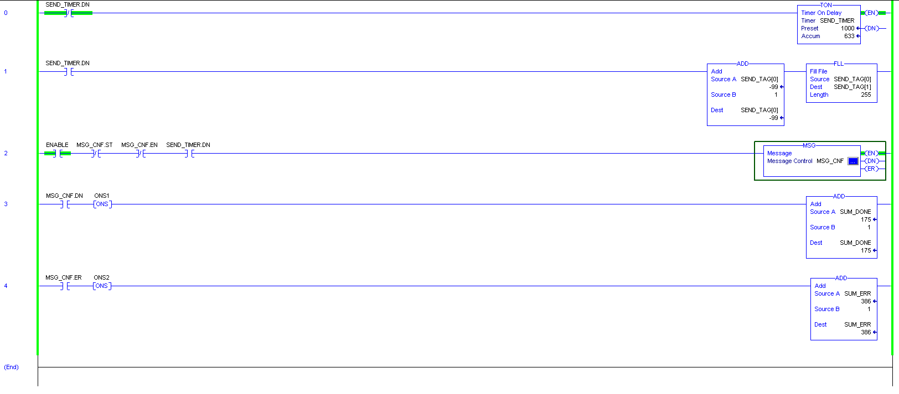
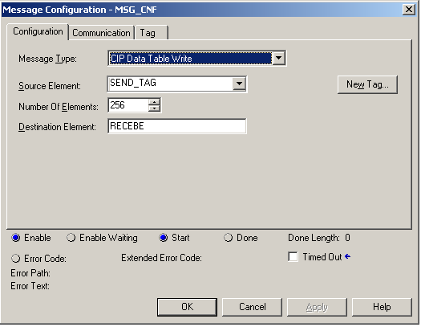
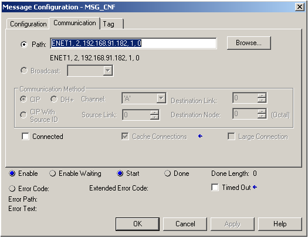
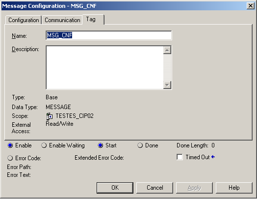

<meta name="google-site-verification" content="DDrF9iv6_IvjRYI6CWMHWpnh3Li6U0qu6HlsvfmrQZA" />

# About
Driver/library to communicate with Rockwell PLCs (ControlLogix family) using CIP protocol over Ethernet/IP. This library was developed in .NET Core 2.0, supporting cross-platform (Linux/Windows). The bigger advantage of this Driver is the possibility to write data (send a message) to a device or PC in both directions. We don't need to making polling checking for new information (unlike implicit messages work - via UDP protocol, degradating the network). The information will be send to us just when it's ready, finally available.

# Features
- When the CIP class is instantiated, one outcoming connection is established with the PLC to send messages to PLC, working like a send channel (data from Driver to PLC). A socket server is created to handle incoming connections, receiving channel (data from PLC to Driver). Each 'MSG' instruction block initialize a receiving connection in the Driver side;
- Using explicit message implementation: SendRRData;
- Using only TCP protocol;
- A sample program is located in 'Program.cs' file. It explain how to use this library;
- NOP message implementation for all connection. Watchdog/life message is not necessary in the application level;
- Support many data types: BOOL, SINT, INT, DINT, LINT, USINT, UINT, UDINT, etc;
- To receive data in the PLC you just have to configure a 'Controller Tag' like 'Read/Write' for 'External Access'.

# Attention points
- The 'Connected' checkbox in the 'MSG' instruction block ('Connection' tab) MUST be unchecked. The Driver doesn't implement 'Connecting Manager - Forward Open'. Supporting only 'Unconnected messages'. Don't worry about the performance. It is not affected. The socket connections remain established even when there is no application message traffic. Thanks NOP message implementation (working like a life/watchdog message).
- Receiving data in PLC: in some scenarios we could have a higher traffic of data from Driver to PLC and the received data could be overwriting before it is treated. In these cases, we recommend that an ACK message is implemented for data flow control (from PLC to Driver). Driver would send the next message just when the ACK message is received;
- To use a different listen port in the Driver side (the default port is 44818), just change de 'Path' field in the 'MSG' instruction block property windows. Like this: 'ENET1, 2, 192.168.91.182:44820, 1, 0'. Now the new port is 44820. Understanding 'Path' field: ENET1 is a summary of the first backplane and slot (1, 4 – in my case). The second attribute is always 2 (to go outside to the Ethernet). The third attribute is the IP address followed by the port. The last two attributes are the remote backplane and slot (could be anything, the Driver doesn’t check these attributes);

# Donate

# PLC Program Example

